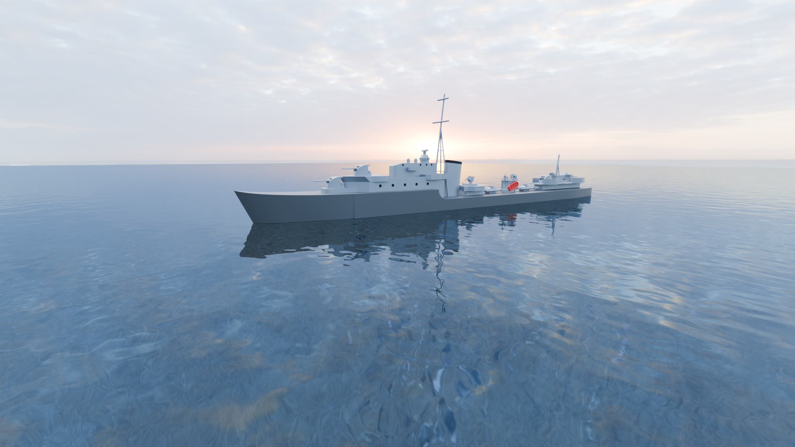

# Animace ve 3D

Součástí videa byly také 3D animace. Na tu jsme opět použili vlastně vytvořené objekty (lodě), které jsme zasadili do animace.
Postup byl podobný, opět použití *keyframes* a vytvoření následné scény.

Tato část ve videu je krátká, ovšem zde jsme se potýkaly se značnými problémy. Samotné scený mají pod 20 vteřin.

