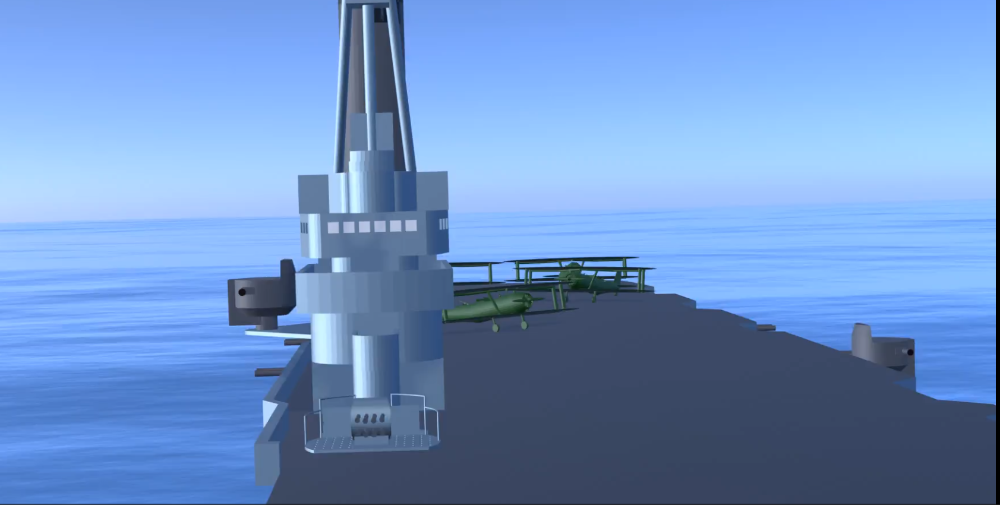

# Animace ve 3D

Součástí videa byly také 3D animace. Na tu jsme opět použili vlastně vytvořené objekty (lodě), které jsme zasadili do animace.
Postup byl podobný, opět použití *keyframes* a vytvoření následné scény.

Tato část ve videu je krátká, ovšem zde jsme se potýkaly se značnými problémy. Samotné scený mají pod 20 vteřin.

*Náhled na Ark Royal v animaci*

Tato animace byla taktéž tvořena celá v programu Blenderu. Zde jsme měli značné problémy s přechody a posuny lodí, aby byly plynulé. Nedařilo se nám opakovaně renderování, což byla drobná chyba v nastavení blenderu při renderování snímků, a to zapříčinilo, že se podařila až x-tá verze.

Výsledek této animace byl rozkouskován do výsledného videa.
