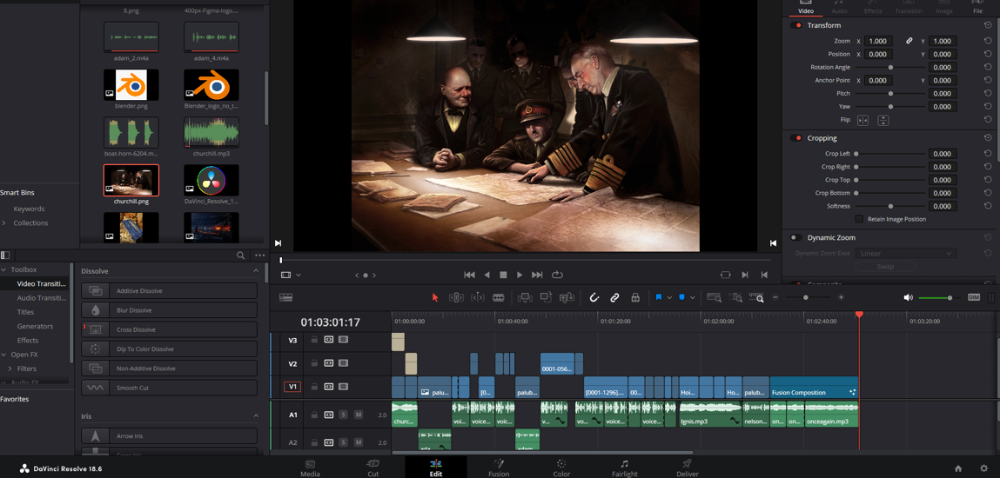
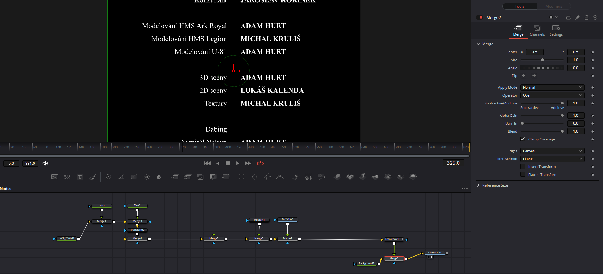

# Střih videa

Toto je již závěrečná část videa, kde již jen nastane pár kosmetických úprav a hlavně doplnění zvuku na pozadí.
Komentáře + hudby.

Pro samotný střih jsme použili program Davinci Resolve. Do něj jsme nahráli hotové již hotové sekvence z Blenderu, které teď již jen na sebe napojíme.

Byly přidány různé efekty do videa, hlavně ty přechodové mezi scénami.

## Titulky

Tvorba titulek byla druhou nejdelší části po střihu ve zpracování videa.
Titulky byly vytvořeny pomocí spojení vícero "komponent", které určovaly pozici a také následný pohyb a rychlost titulků.

Přidávání obrázku nebylo nejlehčí, jelikož obrázek se nepohyboval stejně jako text, ale všechny zádrhely se podařilo odstranit.

*Tvorba titulků*

## Výsledné video
Finální verze videa je o délce 3:02. Je dostupné pod odkazem na YT [zde](https://youtu.be/3YP97cjQy48)