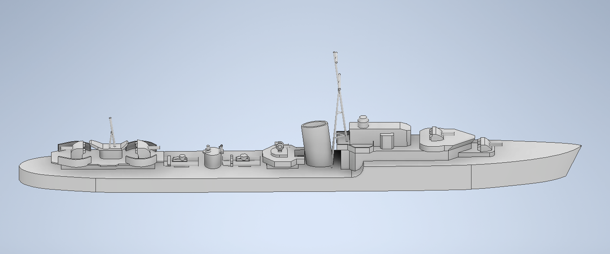
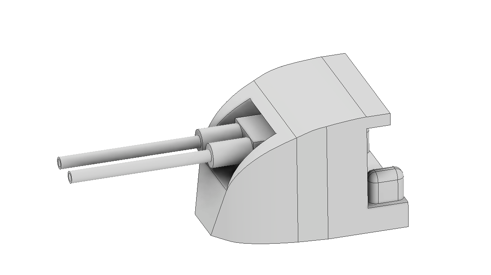

# Modelování

Model lodi byl vytvářen a vymodelován v programu Autodesk Inventor. Model, který se poté tisknul na 3D tiskárně, byl vymodelován za 25 hodin. Při modelování byl problém s předlohou, jelikož existuje velmi omezený počet fotek, popisů, výkresů či dalších modelů HMS Legion. Proto bylo někdy nutno použít a inspirovat se podobnýma loděma, nejčastěji dalšími protiletadlovými torpédoborci třídy L. Se samotným modelováním nebyl v podstatě žádný problém a i přes již zmíněné komplikace s předlohami se výsledný model velmi povedl.

*Modelování HMS Legion*

