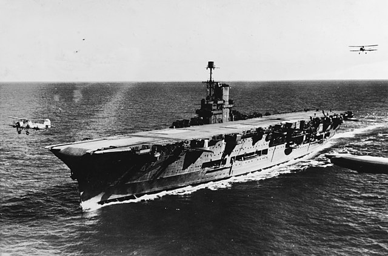

# HMS Ark Royal

Jako loď k našemu projektu jsme si zvolili britskou letadlovou loď HMS Ark Royal.
Návazali jsme na náš předchozí projekt, kde jsme zpracovávali HSM King George V.

Hlavní loď doprovází ještě HMS Legion. Obě lodě jsou uloženy na polystyrenovou podložku, kde vrstvy z aluminiové folie simulují povrch vodní hladiny.

*Dobová fotografie, rok 1939*
