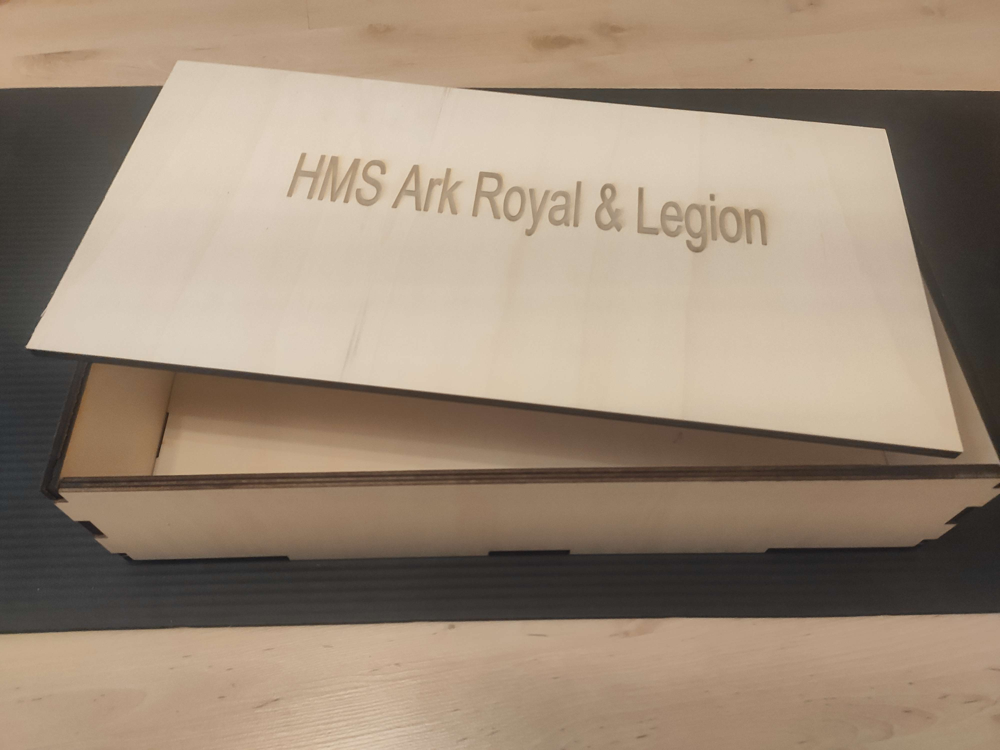
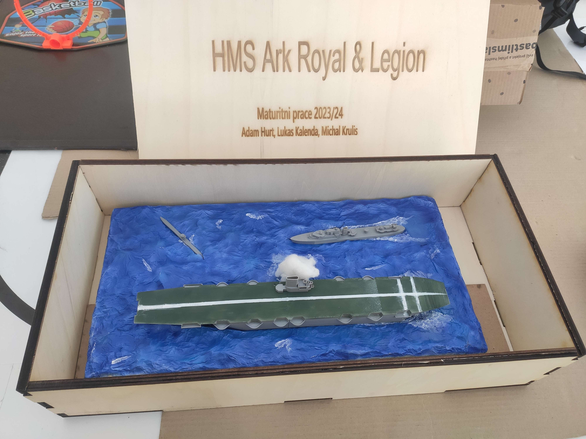

# Krabice

Samotné lodní dioráma jsme potřebovali někam schovat. Přenášet jen tak desku s uloženými loděmi by mohlo skončit karambolem. Rozhodli jsme se proto vytvořit jednoduchý návrh krabice.

Ten počítá s tím, že si z desky o rozměrech **1200 x 600 x 10 mm**. Tu jsme vložili na laser, který nám v daných obrysech desku prořezal. Na více místech se to bohužel úplně neprořízlo, čehož jsme si všimli až po vyndání desky.

Druhé prořezání ovšem již bylo úspěšné a vypadli nám všechny dílky jako ze skládačky. Součásti krabice je také vnitřní přihrádka, kam můžou být uložené drobnější věci. Přes náhradní dílky, až pro brožuru, která mapuje náš projekt.
Na vrchu podložky je gravírování s názvem našeho projektu a doplňkovými informacemi k naší práci.

*Krabice po první verzi*

*Krabice druhé verze, včetně lodě*

