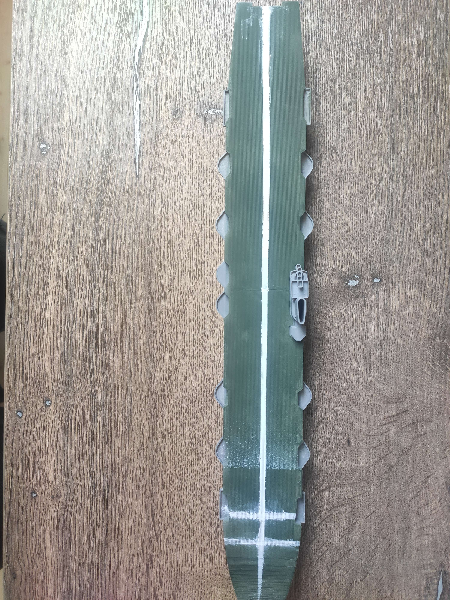

# Natírání povrchu

Za využití airbrushe a následně i štětce byla natřena paluba lodi Ark Royal na zeleno. Zde byla použita zelená akrylová barva, naředěná s vodou v poměru 1:3.

Po první vrstvě bylo potřeba udělat ještě druhý nátěr, jelikož tisk nebyl na povrchu zcela hladký, ale byly v něm drážky od tiskové hlavy. Druhý nátěr již tyto nesrovnalosti zahladil.

Po uschnutí barvy byl štětcem namalovány přistávácí čáry. Zbytek lodi bylo nutno zakrýt izolepou a snažit se vytvořit co nejpřesnější čáru. Na konci lodi ještě potom dvě doplňkové čáry po start a parkování letadel.

*Přistávací plocha modelu*

## Zbylé detaily

Ostatní části byly zachovány v původní barvě tisku, jelikož ta se i nejvíce podobá té reálné, ocelové konstrukci.