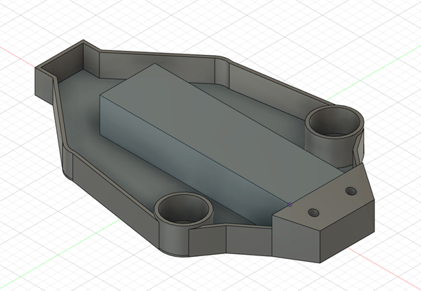
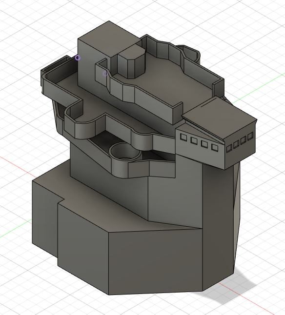
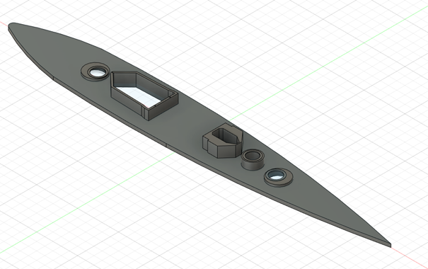

# Fusion 360

Zde jsme začali naše 2D pohledy přetvářet do reality. Tento proces zabral nejvíce času. Práce utíká zhruba stejně a je vše potřeba správně přetavit do 3D prostoru. 
Detailnější části, jako dělové věže a můstky zabral nejvíce času, jelikož se musí postupovat po vrstvách, kdy na některých objektech jich je i desítka a více.
Postupně jsme vytvořili takovéto jednotlivé dílky, které potom byly složeny do sestav. Využívali jsem výhradně program Autodesk Fusion 360. Ten nabízí cloudové uložení, takže na projektu mohlo pracovat současně více lidí na ráz, zároveň je i každý objekt zálohován historií verzí změn.

*Podložka jedné části*

*Velín*

*Podlaha lodi*
