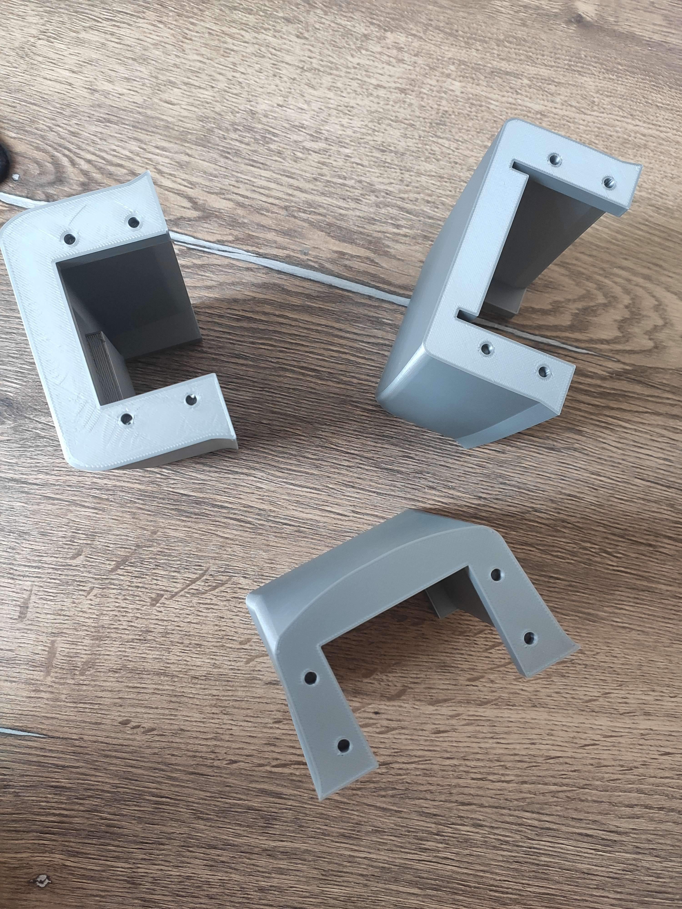
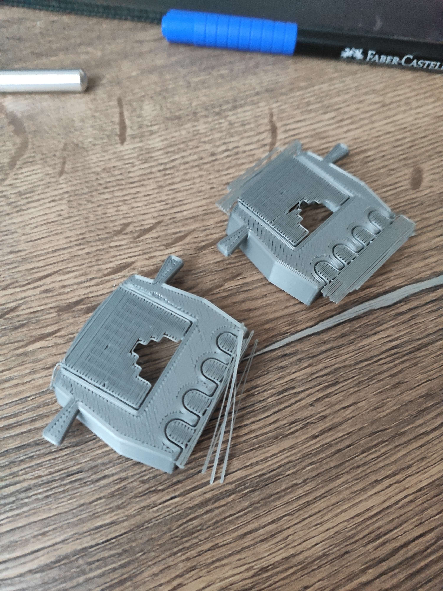

# Typ tisku

Celkově se loď skládá ze **64 dílků** různých velikostí. Trup jsme rozdělili na 4 části, které byly slepeny lepidlem. Plocha na plochu by jen tak nedržela, tudíž jsme do krajů spoů vložili 2-3 cm tyče, které sloužili jako výstuž.
Použili jsme podobný plast, jako hmoždinka, drží to perfektně. Při testování bez nátěru do lodi nezatékalo.

*Dělové věže*

## Jak to vytiskneme?

Tímto se dostáváme na výběr materiálu vlastně samotnému druhu tisku. Dostupné variantu tisku pro nás byly vlastně jen dvě. FDM a Resin. První, FDM, je ta známá tisková hlava, která jezdí nad objekty a ten roste z podložky. Její použití je velice rozšířené a i pro nás vhodné.

Druhou variantou byl Resin. Ten je cenově dražší, jelikož se nevyužívá nějaké klubo materiálu, ale kapalina, která při kontaktu světlem ztvrdne. Jeho výhoda je hlavně na detailní objekty, jelikož jejich výsledek je naprosto přesný a nezáleží prakticky na velikosti.

Náš model nebyl tvořen do takového detailu, takže jsme zvolili čistě možnost FDM.

Jaký materiál zvolit?

