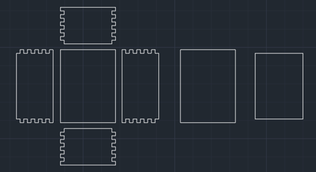

# 1. výstup

Poté, co jsme si zpracovali analýzu projektu, jsme se dali do práce v prvním výstupu. Rozdělili jsme si to na tři hlavní části.
- Modelování
- Pokusná podložky
- Krabice

## Modelování

Většinu potřebných zdrojů, pohledů, náčrtů jsme vzali z analýzy a začali modelovat. Detailně je práce představena v sekci [zde](../ark-royal/uprava-modelu.md).

## Výroba podložky

Začali jsme také vyrábět podložku. Nebylo předpokládáno, že se povede na první pokus, takže jsme to brali i ve výstupu jako doplněk, respektive test.
Pracovali jsme jen s kombinací aluminiové folie + polystyrenu. Přesto se první, zmenšený pokus, velice povedl a nebylo potřeba měnit techniku.
Více rozepsaný postup je [zde](../ark-royal/vodni-hladina.md)

## Náčrt krabice

Celý model jsme chtěli někam uložit pro případ přenosu, respektive aby loď nebyla pouze na podložce celou dobu.
K tomu jsme zakoupili dřevěnou desku, kterou jsme zpracovali na laserovém CNC.

Nejprve jsme si ale v tomto výstupu potřebovali vyrobit náčrt, který bude korespondovat s velikostí vodní hladiny.

*Ukázka náčrtu v programu AutoCAD*
