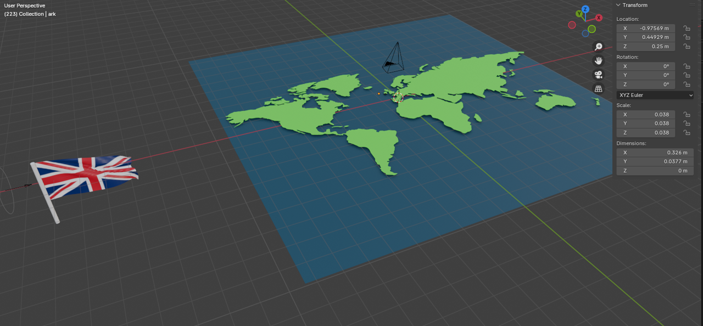

# 4. výstup

Náplní posledního výstupu byo vytvoření animace, respektive videa.
Zároveň jsme vše zkompletovali, hlavně fyzický model, aby byla práce hotová a připravená k prezentaci

## Animace 2D

Pro samotnou animaci jsme použili výhradně program Blender. Ten je volně dostupný a nabízel nám nepřeberné množství funkcí a možností, jak animaci zpracovat. Vzhledem k tomu, že pro všechny práce v tomto programu byla nová, respektive ta činnost co jsme v ní dělali, tak to šlo pomalu a často slepými uličkami.

Ve 2D části jsme si vytvořili mapu, na kterou jsme vložili naše lodě. Pomocí tzv *keyframes* jsme připravili sekvenci pohybů objektů a kamery, ze které byl poskládám výsledný záběr do videa.

Části renderu se vůbec nepoužili, jelikož přesně neseděli s komentářem, který byl klíčový pro video.

*Náhled do programu Blender*

## Animace 3D

Součástí videa byly také 3D animace. Na tu jsme opět použili vlastně vytvořené objekty (lodě), které jsme zasadili do animace.
Postup byl podobný, opět použití *keyframes* a vytvoření následné scény.

Tato část ve videu je krátká, ovšem zde jsme se potýkaly se značnými problémy. Samotné scený mají pod 20 vteřin.

## Střih videa

Na střih videa jsme použili program *Davinci Resolve*. Toto již byla finální pasáž, kde došlo zvukovým úprávám a hlavně střihům, kde jsme poskládali výsledné animace s komentářem, aby vše sedělo.

Byly přidány také doplňující efekty a přechody mezi scény, což byla drobnost.

Větší práce byla ještě s titulky.
Zde docházelo k propojování více "komponent", jelikož se text musel nacházet v nějakém bloku a pak také pohybovat.
Rychlost pohybu je opět založena na časové ose, když se hodila do timeliny.

Video má 3 minuty a je nalezení [zde](https://www.youtube.com/watch?v=3YP97cjQy48).

*Do videa byly použity obrázky ze hry Hearts Of Iron 4 a také World of Warships.
Také hudba, odkazy v popisku videa.*

